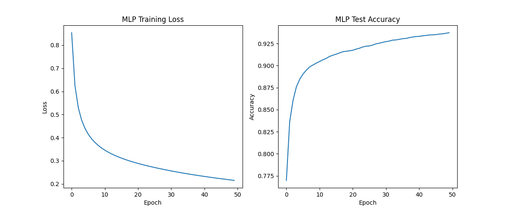
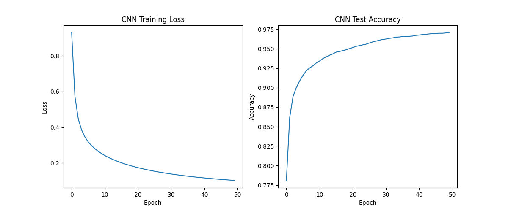

# pure-jax-mnist

A minimal, from-scratch implementation of MNIST classification using JAX, with no external dependencies beyond data loading. This project is a personal learning exercise focused on building neural networks in JAX from scratch, demonstrating how to implement and train simple models, including a Multi-Layer Perceptron (MLP) and a Convolutional Neural Network (CNN), entirely in JAX.

The implementation is inspired by the example of working with PyTrees in the [official JAX documentation](https://jax.readthedocs.io/en/latest/working-with-pytrees.html#example-of-jax-tree-map-with-ml-model-parameters).

## Features

- **Pure JAX Implementation**: Implements neural networks without relying on external deep learning libraries. The models are built using JAX operations and PyTrees for parameter management.
- **Supports MLP and CNN Models**: Provides a choice between a Multi-Layer Perceptron (MLP) and a Convolutional Neural Network (CNN) for MNIST classification.
- **JAX PyTree Parameter Management**: Leverages JAX’s PyTree utilities, inspired by the official JAX documentation, to manage model parameters in a structured and efficient way.
- **Optimized for CPU/GPU Execution**: Runs seamlessly on both CPUs and GPUs (if available), taking advantage of JAX’s JIT compilation for optimized performance.

## Setup and Installation

### Requirements

- Python 3.8 or higher
- JAX (for numerical computations)
- JAXlib (for GPU acceleration)
- Matplotlib (for plotting)
- Torchvision (for MNIST dataset loading)

1. Clone the repository:

```bash
git clone https://github.com/your-username/pure-jax-mnist.git
cd pure-jax-mnist
```

2. Install requirements:

```bash
pip install -r requirements.txt
```

3. Install JAX:
For CPU:

```bash
pip install –upgrade “jax[cpu]”
```

For GPU (if available):

```bash
pip install –upgrade “jax[cuda]” -f https://storage.googleapis.com/jax-releases/jax_cuda_releases.html
```

## Usage

You’re ready to go! To run the training script, use `main.py`, which includes options for choosing the model type and specifying the number of epochs.

Main command-line options:

- --model_type: Specify the model architecture to use. Options are "MLP" for a Multi-Layer Perceptron or "CNN" for a Convolutional Neural Network. The default is "MLP".
- --num_epochs: Set the number of training epochs. The default is 100.

**Note**: On the first run, the MNIST dataset will be downloaded to your machine. This may take a few moments, depending on your internet connection. Subsequent runs will use the locally stored dataset.

### Example Commands

Run the MLP model for the default 100 epochs:

```bash
python main.py --model_type MLP
```

Run the CNN model for 50 epochs:

```bash
python main.py --model_type CNN --num_epochs 50
```

## Training Results

Below are the training plots for both the MLP and CNN models. These plots display the training loss and test accuracy across epochs, helping to visualize the model’s learning progress and compare the performance of the two architectures.


### MLP Model



### CNN Model



### Performance Comparison

- **MLP**: The MLP model is faster to train but generally results in lower accuracy compared to the CNN.
- **CNN**: While the CNN model takes significantly longer to train due to the complexity of convolutional operations, it achieves higher test accuracy.

## Recommended Libraries

While this project is implemented from scratch for the sake of learning, one of the strengths of JAX lies in its interoperability with other libraries. For those looking to explore more advanced options in JAX, here are a couple of libraries worth checking out:

- [Optax](https://github.com/google-deepmind/optax): A powerful and flexible library for optimization in JAX, providing a suite of optimizers that work seamlessly with JAX to help you efficiently train your models.

- [Equinox](https://github.com/patrick-kidger/equinox): A great choice for building neural networks in JAX, with `PyTrees` at the center of its design, making it easier to scale and extend your models.

## License

This project is licensed under the MIT License. See the [LICENSE](LICENSE) file for details.
